# KickFlow

KickFlow is a Chrome Manifest V3 extension for Kick.com. It preserves moderated chat context, presents channel events as readable rows, and adds practical controls to the native live player.

English is the default interface language. The General settings tab includes an **EN / TR** selector, and switching it updates the open dashboard immediately. Newly rendered chat and player content uses the selected language.

KickFlow has no backend and does not automate accounts. Session chat history stays in memory, while preferences such as language, feature flags, and hotkeys use Chrome extension storage.

## Preserved chat and moderation context

KickFlow keeps the conversation understandable when moderation removes content:

- deleted messages retain their original text with a **DELETED** marker and moderator attribution when available;
- permanent bans preserve recent messages with a **BANNED** marker;
- timeouts preserve recent messages with a duration such as **TIMEOUT 10M**;
- native-chat mode restores removed messages inline;
- KickFlow-chat mode renders its own safe message list;
- the Removed tab provides a session-scoped ledger of deleted, timed-out, and banned messages.

On Kick's native Active Chatters list, KickFlow adds a removed-count badge when the session ledger contains moderation evidence for that user. Selecting the badge opens Removed filtered to that person; Kick's native row click and moderation controls remain unchanged.

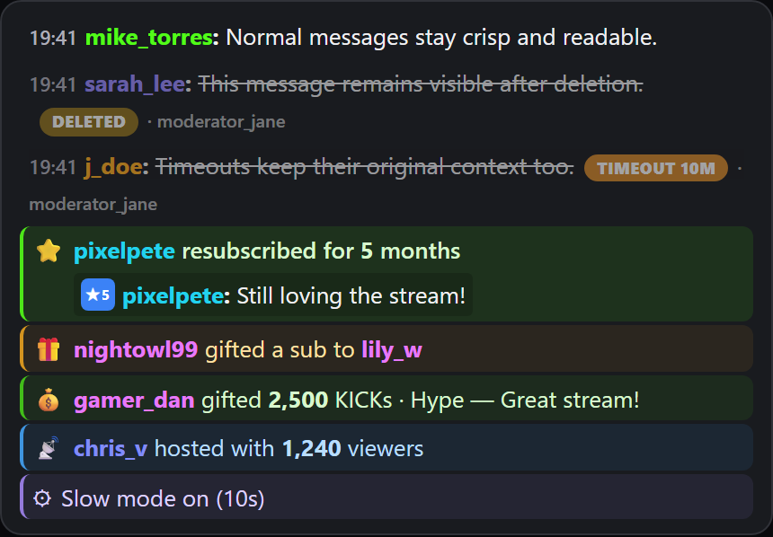

_Offline component render of the production message renderer and CSS. All messages and identities are synthetic._

## Subscriptions, gifts, Kicks, hosts, and mode changes

Compact system rows cover:

- new subscriptions and renewals with month counts;
- single and bulk gifted subscriptions;
- Kicks gifts with grouped amounts, gift names, and sender notes;
- host and raid activity with viewer counts;
- slow, followers-only, subscribers-only, and emotes-only mode changes.

Bulk gifts show the first three known recipients and an **and N more** control. Selecting it expands every known recipient in place. Usernames and other event values are inserted as text, never as HTML.

System-event senders and gift recipients use distinct colors and open the same profile cards as chat usernames. KickFlow reuses a known session chat color when available and otherwise assigns a deterministic palette color.

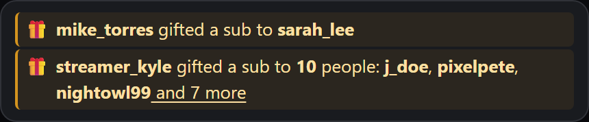

_Offline component render of the production collapsed-gift row with synthetic identities._

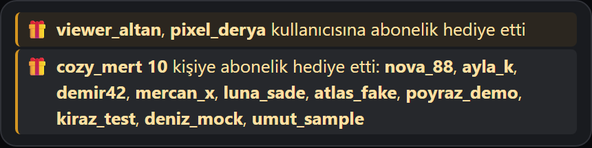

_Offline component render of the same production row after expansion, using synthetic identities._

KickFlow also preserves space for Kick's native event stack so native pinned messages, polls, goals, and pinned Kicks remain visible and interactive. Polls are native passthrough, not a reimplemented poll UI.

<!-- TODO: owner live screenshot of Kick's native pinned-message and poll stack beside KickFlow chat -->

## Safe chat rendering and user cards

The custom message renderer supports Kick emotes, mentions, web links, replies, role badges, subscriber badges, and user colors. It validates image and link destinations, renders untrusted values through DOM text APIs, and opens same-origin links without letting Kick's page router replace the current view.

Selecting a username opens a draggable profile card with the user's relationship details, badges, follower count, profile metadata, and a safe new-tab link. Middle-click and modified-click profile navigation are supported.

Reply previews preserve emotes and can be selected to scroll to the original message. If the original has left KickFlow's rendered chat window, the preview gives a brief miss indication. In KickFlow-chat mode, message spacing, timestamp visibility, font and emote scaling, and badge geometry follow Kick's native presentation settings.

## Personal and role highlights

KickFlow can highlight chat rows that @mention the owner or reply to the owner's messages. A manual Kick username is available when owner identity cannot be detected automatically.

Each layer is independently controlled: the personal mention/reply highlight, moderator accent, and VIP accent each have their own on/off switch and their own color, selected from curated swatches or a guarded custom picker (defaults: amber for personal, teal for moderator, pink for VIP). The personal layer has its own frame, fill, or combined style.

Moderator and VIP rows share one style setting. **Bar only** — the default — draws just a slim left accent bar, keeping busy chat easy on the eyes; **Bar + fill** adds a faint row tint for anyone who prefers the stronger cue. Role accents remain visible when layers overlap: a personal fill replaces the role tint but never the role bar, and the existing green reply-jump flash keeps priority over the personal outline.

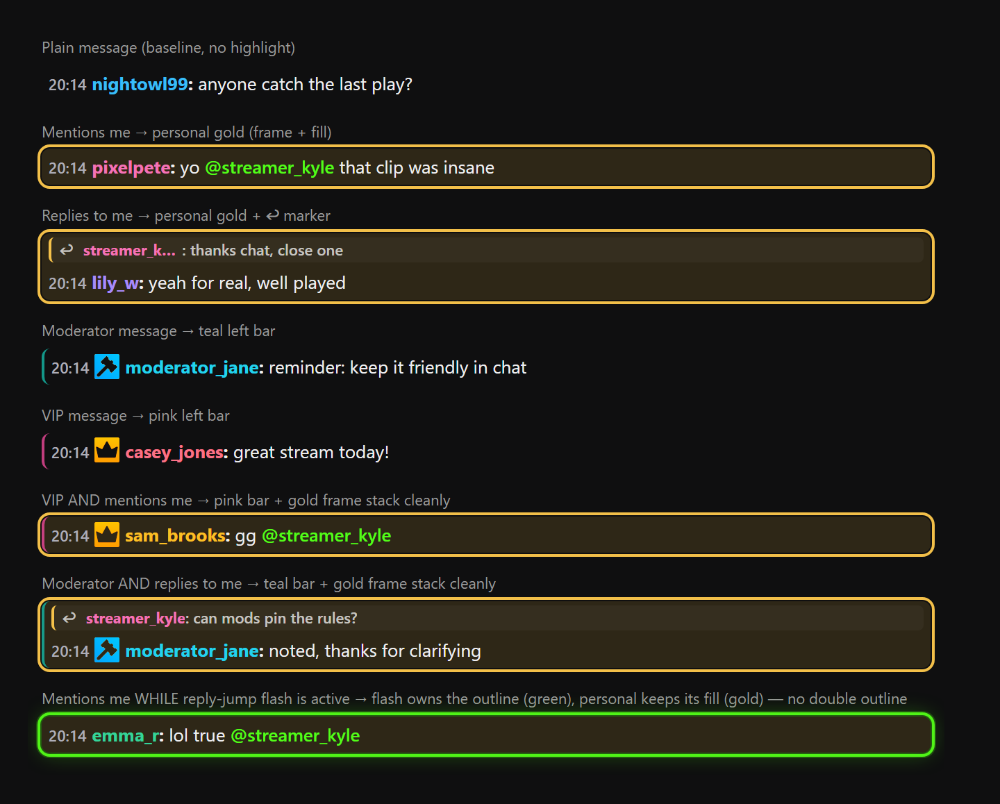

_Offline component render of the production message renderer, highlight resolver, and CSS with synthetic identities and chat content._

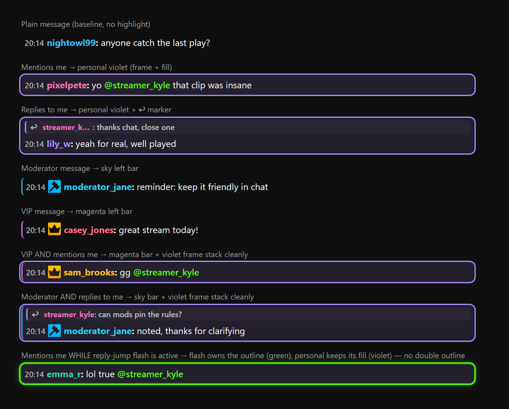

_The same states with independently chosen violet personal, sky moderator, and magenta VIP colors._

## Live player tools

KickFlow mounts its controls directly into Kick's native player bar:

- **10-second seek:** back and forward buttons share DVR-safe bounds with the rebindable arrow-key actions. Holding an arrow repeats at a controlled rate.
- **LIVE and catch-up:** the live button shows how far playback is behind, returns to the live edge, temporarily uses 1.5x playback for catch-up, and returns to 1x near live.
- **Highest quality:** selects the highest genuinely available native quality while excluding Auto and unavailable login-gated options.
- **Speed controls:** offers automatic mode and manual speeds from 0.25x to 3x, with a buffer-pressure fallback.
- **Screenshot:** saves the current decoded video frame as a PNG.
- **Automatic theater mode:** enters Kick's native theater layout once per media load without overriding a later manual exit.

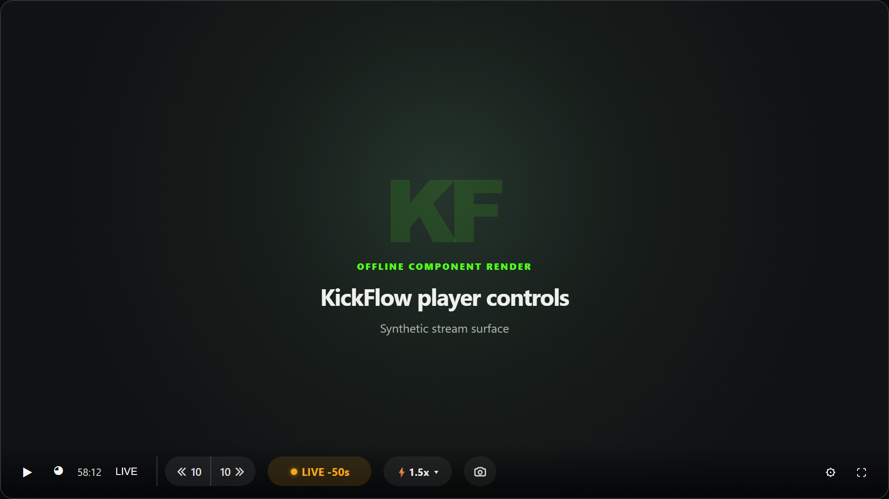

_Offline component render of the real seek, live catch-up, speed, and screenshot modules with production CSS. The synthetic stream is 50 seconds behind, so LIVE and 1.5x catch-up are visible._

## Settings dashboard, every screen

The navbar and chat-footer entry points open one shared, keyboard-accessible dashboard. Escape closes it, focus stays inside while open, and settings apply immediately.

### General

General shows live session diagnostics, selects native or KickFlow chat, and contains the EN / TR language selector. English is selected by default.

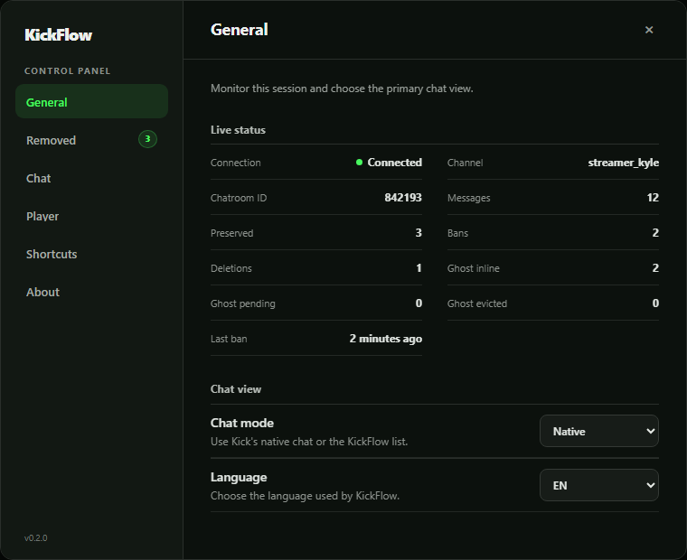

_Offline component render of the production General tab with synthetic status data._

### Removed

Removed lists preserved moderation events newest first with the original message, action type, duration, and moderator when known.

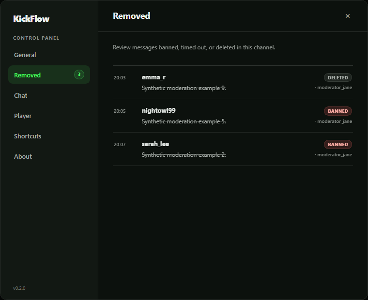

_Offline component render of the production Removed tab with synthetic moderation data and identities._

### Chat

Chat controls deleted-message preservation, inline bans, subscriptions, gifted subscriptions, Kicks, host and raid events, mode changes, sidebar refresh, Active Chatters evidence badges, and the independently configurable personal, moderator, and VIP highlights.

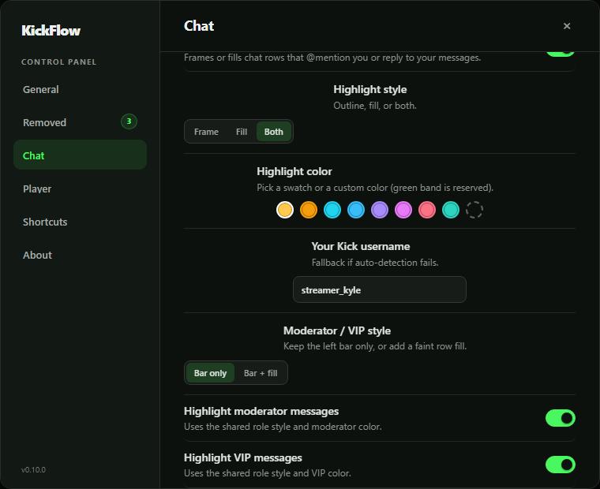

_Offline component render of the production Chat tab._

### Player

Player controls automatic theater mode, seek buttons, live catch-up, highest quality, screenshots, and speed controls.

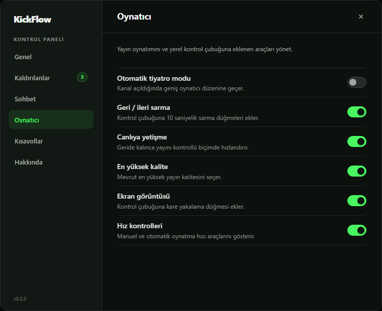

_Offline component render of the production Player tab._

### Shortcuts

Shortcuts enables, disables, and rebinds each action live. Duplicate bindings are rejected, modifier-only keys are rejected, and potential conflicts with Kick's native shortcuts are reported.

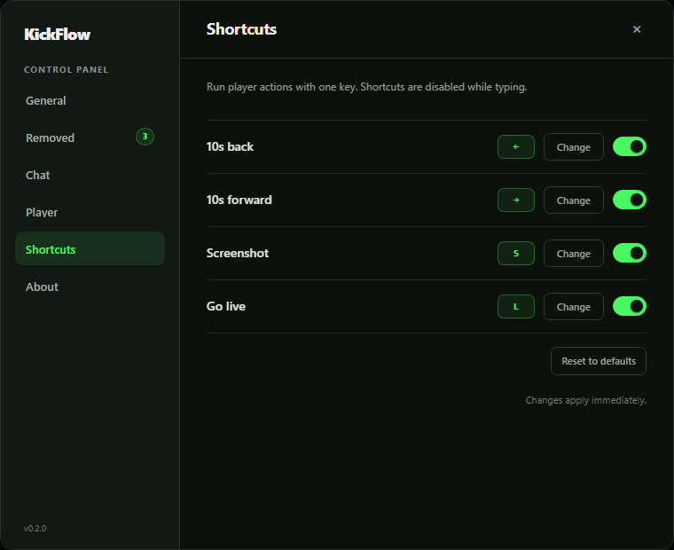

_Offline component render of the production Shortcuts tab and its real default bindings._

### About

About reports the installed KickFlow version, extension platform, and application scope.

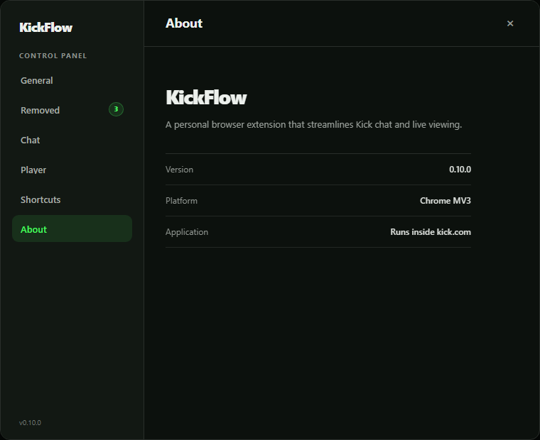

_Offline component render of the production About tab._

## Default hotkeys

| Action | Default |
| --- | --- |
| Seek back 10 seconds | `←` |
| Seek forward 10 seconds | `→` |
| Capture the current frame | `S` |
| Return to live | `L` |

Hotkeys are ignored while typing in inputs, text areas, selects, editable content, and chat editors. Ctrl, Command, and Alt combinations are left to the browser and page.

## Sidebar refresh

KickFlow periodically refreshes followed and recommended channel rows through Kick's channel endpoint. It updates live indicators and viewer counts, reversibly hides confirmed-offline rows, retries transient failures, and reapplies cached state when Kick rerenders the sidebar.

<!-- TODO: owner live screenshot of refreshed followed and recommended channel states -->

## Popup and diagnostics

The extension popup mirrors the active tab's status, counters, chat and player feature switches, and hotkey controls. It uses the selected EN or TR language and reports when the active tab is not a supported Kick channel.

## Installation

### Release archive

1. Download the latest release archive from the [Releases page](https://github.com/ydbilgin/kickflow/releases/latest).
2. Extract the archive.
3. Open `chrome://extensions` and enable **Developer mode**.
4. Choose **Load unpacked** and select the extracted folder containing `manifest.json` and `dist/`.

### From source

Node.js and npm are required.

```bash
npm install
npm run build
```

Open `chrome://extensions`, enable **Developer mode**, choose **Load unpacked**, and select this repository. Rebuild and reload the extension after source changes.

## Development

```bash
npm run typecheck
npm test
npm run build
```

| Layer | Technology |
| --- | --- |
| Extension platform | Chrome Manifest V3 |
| Application code | TypeScript 5.6 |
| Bundling | esbuild 0.24 |
| Tests | Vitest 4.1 and jsdom 29 |
| UI integration | Content scripts over Kick's native DOM and public event interfaces |

All documentation PNGs are generated in headless Chromium from real KickFlow TypeScript modules and production CSS. The harness is strictly offline, uses synthetic data, and never opens Kick.com.

## Scope and disclaimer

KickFlow is a personal project provided as-is. It is not published on the Chrome Web Store and is not affiliated with, endorsed by, or sponsored by Kick. Site DOM, API, or event changes may require maintenance.
